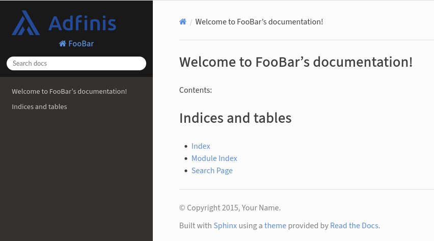

# Adfinis Sphinx Theme

This theme is just an addition to the [read the docs theme](https://sphinx-rtd-theme.readthedocs.io/).
It depends on the rtd theme and just adds custom fonts, image and a few lines of CSS for Adfinis colors.

It is a bit hacky as it just "overrides" certain variables in the configuration.
But this makes it extremely simple to install.
Maybe it makes sense to add an entrypoint which only adds the static files (or a config variable to do so).



## Usage

Add this project as dependency to `pyproject.toml`:
```bash
adfinis_sphinx_theme = { git = "https://github.com/adfinis/adsy-sphinx-template.git", branch = "master" }
```

Add the following to your sphinx `conf.py`:

```ini
extensions = [
    # Add this to the extensions
    'adfinis_sphinx_template',
]
```

The following variables will be automatically [set/overriden](adfinis_sphinx_theme/__init__.py) by the template:
- `html_title`
- `html_theme`
- `html_logo` (This is not set but should be null, as the logo is inserted with CSS)

## Demo

The demo page can be built with:

    poetry run sh -c 'cd example; make html'

# Notes

There used to be s5 and Latex changes to the rtd theme, but they were abandoned.
If they ought to be resurrected, check the git log.
